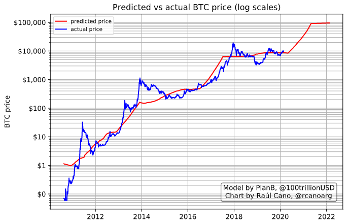

The purpose of this work is to replicate the results by PlanB in his article "Modeling Bitcoin's Value with Scarcity":

https://medium.com/@100trillionUSD/modeling-bitcoins-value-with-scarcity-91fa0fc03e25

PlanB's GitHub page:

https://github.com/100trillionUSD


In short, the original work of PlanB has been replicated successfully.
Not only that, I used a dataset 10 times bigger than the original one and the logarithmic relationship between SF and Market capitalization of bitcoin holds (he used the average value of BTC per month, while we have used one data point each 3 days).
In this case, the value of the linear relationship are only slighly different:

```
ln(Market cap) = 3.56*ln(SF) + 14.09
```



The SF model for BTC price predicts very accurately the logarithm of the BTC price based on the logarithm of the SF value, with an error of less than 20% most of the time. However, this accurate prediction does not translate well to the prediction of the BTC price, which ranges wildly from very low error to values in the range of 100% / 200%.

Additionally, it also encouraging that the work done here has used different sources of data and tools than the ones he used in PlanB's paper.
The price dataset used in this exercise has limited the granularity to at least one datapoint each 3 days. As soon as more data are available, we can run this again and obtain updated results.